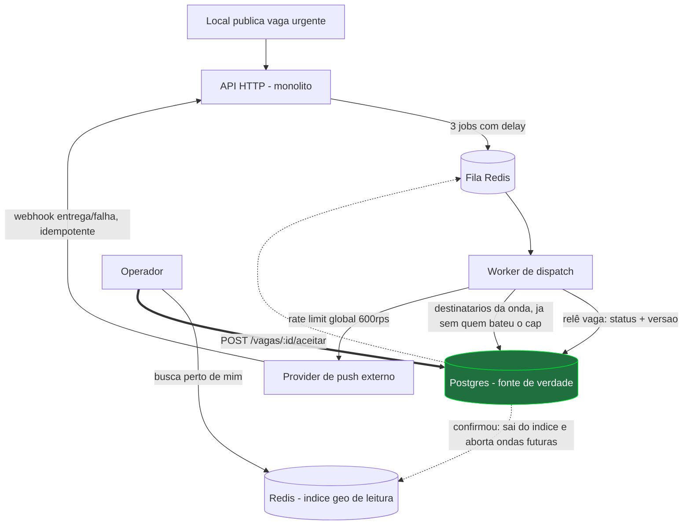

# Decisões



O traço grosso é o que está implementado neste repositório. O resto é desenho.

## Modelo de dados

`vagas` — `status` (`aberta` → `confirmada` | `cancelada` | `expirada`), `operador_id` (só quando
confirmada), `data_inicio`, `valor_centavos`, `timezone`, e **`versao`**, que incrementa a cada
edição relevante do local.

`dispatch_ondas` — uma linha por onda: `vaga_id`, `numero_onda` (1–3), `status` (`agendada` →
`disparando` → `concluida` | `abortada`), **`versao_vaga_no_agendamento`**, `disparar_em`.
`UNIQUE (vaga_id, numero_onda)` torna reagendar idempotente.

`notificacoes` — `vaga_id`, `onda_id`, `operador_id`, `status` (`enfileirada` → `enviada` →
`entregue` | `falhou`), `tentativas`, `provider_message_id`. Serve a três coisas ao mesmo tempo:
contagem do anti-spam, chave de idempotência do webhook e auditoria de qual onda alcançou quem.

`operador_favoritos` e `operador_historico_local` alimentam as ondas 1 e 2.

Três restrições fazem trabalho que eu não quero em código de aplicação:

- `CHECK ((status = 'confirmada') = (operador_id IS NOT NULL))` — vaga confirmada sem dono, ou
  dono sem confirmação, são estados que o banco recusa.
- `UNIQUE (vaga_id, operador_id)` em `notificacoes` — o mesmo operador nunca recebe duas
  notificações da mesma vaga, mesmo caindo em duas ondas. Com `INSERT … ON CONFLICT DO NOTHING
  RETURNING`, a mesma instrução deduplica, torna o disparo idempotente e devolve exatamente quem
  precisa de push.
- `UNIQUE (provider_message_id)` — idempotência do callback.

No repositório só existem `vagas` e `operadores`: as tabelas que o endpoint entregue realmente
toca. Tabela sem código que a use é dívida, não entrega.

## Requisito 2 — nunca dois confirmados

Uma instrução, sem transação explícita:

```sql
UPDATE vagas SET status = 'confirmada', operador_id = $1, atualizada_em = now()
 WHERE id = $2 AND status = 'aberta';
```

O Postgres serializa UPDATEs concorrentes na mesma linha. O primeiro pega o lock e escreve; os
outros bloqueiam e, quando o lock sai, **reavaliam o `WHERE` contra a versão nova da linha**
(EvalPlanQual, em READ COMMITTED). `status` já não é `aberta`, o predicado falha, `rowCount = 0`,
API responde 409 — sem ter escrito nada.

Preferi isso a `SELECT … FOR UPDATE` + `UPDATE`: um round-trip a menos, sem transação explícita
para vazar, e a janela entre ler e escrever simplesmente não existe. Lock em Redis seria pior
ainda: passaria a exigir que um segundo sistema esteja correto para a garantia valer.

409 em volume alto é **sinal de saúde**, não incidente: significa que o "primeiro que aceita, leva"
está sendo exercitado. É métrica, não alerta.

O teste faz 100 requisições HTTP simultâneas contra o servidor e o banco reais, e repete em 5
rodadas independentes — uma rodada passar pode ser sorte de escalonamento; cinco, não.

## Ondas: agendamento, disparo, interrupção

**Agendamento.** Ao publicar uma vaga com menos de 24h, entram três jobs com delay numa fila
Redis. O intervalo é `max(2min, tempo_restante / ondas_restantes)`, contado até
`data_inicio − margem` — notificar 30 segundos antes de começar não preenche vaga nenhuma. Se a
próxima onda não cabe respeitando piso e margem, **as restantes colapsam num disparo só**: vaga
publicada em cima da hora não tem três ondas para dar.

**Disparo.** O worker relê a vaga e aborta a onda se `status ≠ aberta` **ou** se
`versao ≠ versao_vaga_no_agendamento`. Passando, monta os destinatários (favoritos → histórico de
12 meses → raio + especialidade), corta quem já recebeu 3 notificações hoje **antes do envio**
(dia no fuso do operador, não do servidor) e insere em `notificacoes`.

**Interrupção.** Confirmar ou cancelar marca as ondas pendentes como abortadas e remove os jobs —
mas a garantia real é a revalidação no disparo. Remover o job é otimização; se falhar, a onda
roda e se auto-invalida. Isso elimina a corrida entre "cancelar" e "tirar da fila". Editar
incrementa `versao` e replaneja as pendentes com a versão nova; onda já disparada não é reenviada.

## Provider de push

Fila de saída própria, com **rate limiter global de 600 rps compartilhado por todos os workers** —
não por vaga: no pico de segunda há vários dispatches em onda 3 ao mesmo tempo, e limitar cada um
isoladamente não impede o estouro agregado. Em 429/5xx, retry com backoff exponencial **e jitter**
(sem jitter, a onda inteira volta ao provider no mesmo milissegundo); estourado o teto, a
notificação vira `falhou` e a onda segue — uma notificação não trava as outras. O webhook atualiza
por `provider_message_id` e não regride estado terminal, então reentrega não tem efeito.

## Requisito 4 — latência, e o que eu mediria

Postgres continua fonte de verdade; a leitura sai de um índice geoespacial no Redis
(`GEOSEARCH`) com os campos de filtro na própria entrada, e a invalidação acontece no mesmo
caminho que muda o status. Assim o caminho crítico da busca não toca o Postgres.

**Leitura crítica do enunciado:** "remover no mesmo commit" é impossível ao pé da letra — Redis e
Postgres não compartilham transação. Trato como "no mesmo caminho de código, logo após o commit",
e a janela residual é coberta pelo próprio requisito: o `POST /aceitar` sempre corrige com 409. A
garantia de exclusividade nunca depende de o Redis estar certo.

Mediria: p50/p95/**p99** da busca; **staleness** (vagas não-abertas ainda presentes no índice) — é
o número que prova ou derruba a consistência da lista; taxa de 409 no aceitar; taxa de 429/5xx do
provider; notificações por operador/dia; e **em qual onda a vaga foi preenchida**, que é o que diz
se a priorização das ondas serve para alguma coisa.

Num spike descartado (fora deste repositório, registrado em `IA.md`) esse desenho deu **p99 = 70ms
a 500 req/s sustentados** e staleness 0.

## Fora de escopo

**A entrega é só a aceitação** — ondas, push, busca geográfica, frontend e autenticação estão fora
do que eu entrego como código de produção. Priorizei o requisito 2 porque é o único onde estar
"quase certo" produz corrupção silenciosa: dois operadores no mesmo trabalho, descoberto pelo
cliente. Latência ruim aparece num gráfico; dupla confirmação aparece numa reclamação.

Os números acima não são estimativa: saíram de um **spike** do desenho inteiro, que fica fora desta
entrega — API e telas em
[jotavtech/fieldpro-frontend-prototipo](https://github.com/jotavtech/fieldpro-frontend-prototipo).
Medi antes de decidir, e entrego só o pedaço que o enunciado pede.

Também fora, por decisão e não por falta de tempo: **PostGIS** (o geoindex do Redis resolve a
fase 1 e é reversível); **scoring de matching** (as ondas já são a regra de prioridade que Produto
pediu — ranking é outro problema); **fila de espera para quem bateu o cap** (vaga urgente não
espera até amanhã); **horário de silêncio** (ver premissa 4); e **autorização** (o enunciado a
declara fora, e ela não muda o desenho da concorrência).
