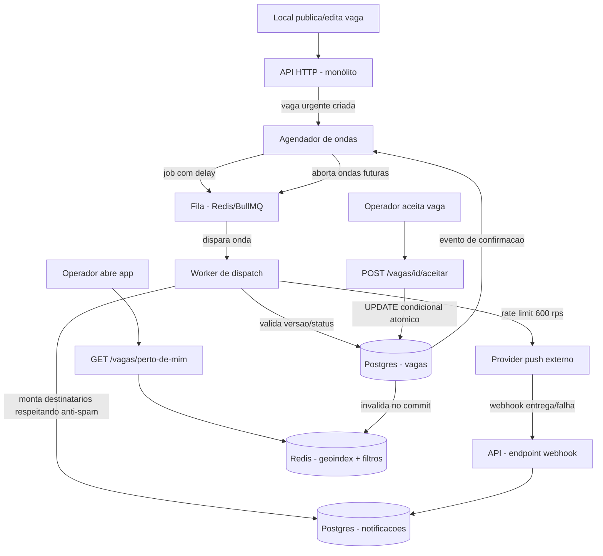

# PRD — Dispatch em Ondas para Vagas Urgentes (FieldPro)

**Autor:** [seu nome]
**Status:** Draft para desafio técnico
**Última atualização:** [data]

---

## 1. Contexto e problema

A FieldPro conecta operadores autônomos a locais que publicam vagas de trabalho pontual. Vagas
publicadas com menos de 24h de antecedência ("urgentes") têm taxa de preenchimento baixa. O
comportamento atual — push simultâneo para todos os operadores elegíveis — gera dois problemas
opostos: o local não preenche a vaga a tempo, e os operadores recebem notificação em excesso e
param de prestar atenção nelas (fadiga de notificação, que piora a conversão em cascata).

**Escala atual:** 120 mil operadores cadastrados (~40 mil ativos/mês), 8 mil locais ativos, ~25 mil
vagas/mês, pico forte de publicação segunda-feira 8h–10h, dois países com fusos diferentes.

**Mudança proposta:** substituir o disparo único por um **dispatch em ondas progressivas**,
priorizando os operadores com maior probabilidade de aceitar, e parando assim que a vaga for
preenchida.

---

## 2. Objetivos

- Aumentar a taxa de preenchimento de vagas urgentes sem aumentar o volume total de notificações
  por operador.
- Garantir que nunca haja mais de um operador confirmado por vaga, mesmo sob concorrência real.
- Manter a busca "vagas perto de mim" rápida e sempre consistente com o estado real da vaga.
- Não estourar o rate limit do provider externo de push, mesmo com múltiplos dispatches
  simultâneos no pico de segunda-feira.

## 3. Não objetivos (fora de escopo desta fase)

- Autenticação/autorização completas (assume-se usuário autenticado via middleware existente).
- Geolocalização com PostGIS "de verdade" (fase 1 usa geohash/Redis geoindex, ver §7.4).
- Algoritmo de matching/scoring de operadores (fase 1 usa as regras de prioridade dadas por
  Produto, não um modelo de ranking).
- Painel de observabilidade custom (fase 1 usa métricas/logs padrão da stack, ver §10).
- Internacionalização de idioma da UI (só timezone é tratado, não idioma).
- Reescrita do provider de push ou troca de fornecedor.

---

## 4. Perguntas em aberto e premissas assumidas

Perguntas que eu levaria para Produto/Tech Lead antes de travar o desenho, com a premissa
assumida para não bloquear o trabalho e o que muda se ela estiver errada:

| # | Pergunta | Premissa assumida | Se a premissa estiver errada |
|---|----------|--------------------|-------------------------------|
| 1 | O intervalo entre ondas é fixo ou proporcional ao tempo até o início da vaga? | Proporcional, com piso mínimo (`max(2min, tempo_restante / ondas_restantes)`); se não sobrar tempo para 3 ondas, colapsa ondas. | Se for fixo, o agendamento fica mais simples, mas vagas muito urgentes (postadas <1h antes) podem nunca chegar à onda 3. |
| 2 | O cap de 3 notificações/dia é só deste fluxo ou é global (conta outras notificações da plataforma)? | Global — soma tudo que vai por push para aquele operador no dia. | Se for só deste fluxo, a fila de elegibilidade fica maior e o risco de fadiga sobe; simplifica a query de contagem. |
| 3 | Quando um operador já bateu o cap, ele é pulado silenciosamente ou entra numa fila de espera para o dia seguinte? | Pulado silenciosamente (vaga urgente não pode esperar até amanhã). | Se precisar de fila de espera, precisa de um job separado de "retry no reset do cap", fora do escopo do dispatch em si. |
| 4 | Existe horário de silêncio (não notificar de madrugada no timezone local mesmo se "urgente")? | Não existe silêncio — "urgente" sempre notifica, dado que a urgência é sobre tempo até o início. | Se existir, precisa de uma regra de adiamento por timezone que pode conflitar com o requisito de intervalo curto entre ondas. |
| 5 | Edição de vaga durante o dispatch (valor, endereço, horário) invalida ondas já agendadas, ou só as futuras? | Só as futuras. Ondas já disparadas não são "desfeitas"; a versão da vaga é registrada no agendamento de cada onda, e ao disparar, se a versão mudou, a onda é abortada e re-planejada. | Se precisar invalidar retroativamente (ex.: reenviar correção), precisa de um evento de "correção" separado do dispatch normal. |
| 6 | "Já trabalhou naquele local antes" (onda 2) tem uma janela de tempo, ou é histórico completo? | Últimos 12 meses, para não incluir operadores inativos/desligados há anos. | Se for histórico completo, a query da onda 2 fica mais cara e pode trazer operadores irrelevantes. |
| 7 | O raio da onda 3 é fixo (ex.: 15km) ou dinâmico por densidade de operadores na região? | Fixo por país/região (parametrizável), começando conservador (ex.: 10km) com um único fallback de expansão se a onda 3 não preencher. | Se precisar ser dinâmico por densidade, precisa de um cálculo prévio de densidade populacional de operadores — mais complexo, adiado. |

---

## 5. Requisitos funcionais

### RF1 — Dispatch em ondas por prioridade
1. **Onda 1:** operadores favoritados por aquele local.
2. **Onda 2:** operadores que já trabalharam naquele local (últimos 12 meses, premissa #6).
3. **Onda 3:** todos os operadores elegíveis dentro do raio da vaga (premissa #7), respeitando
   especialidade compatível.
4. Cada onda só dispara se a anterior não preencheu a vaga.
5. Intervalo entre ondas conforme premissa #1.

### RF2 — Confirmação exclusiva ("primeiro que aceita, leva")
1. Endpoint de aceitação (`POST /vagas/{id}/aceitar`) só confirma se a vaga ainda está `aberta`.
2. Sob concorrência (N operadores aceitando ao mesmo tempo), exatamente um recebe sucesso; os
   demais recebem `409 Conflict`.
3. Nenhuma corrida pode resultar em dois operadores confirmados na mesma vaga (garantia via UPDATE
   condicional atômico no banco, ver §7.2).

### RF3 — Anti-spam
1. Nenhum operador recebe mais de 3 notificações de vaga por dia (contagem global, premissa #2).
2. Operadores que já bateram o limite são excluídos da lista de destinatários de uma onda antes do
   envio, não depois de uma tentativa falha.

### RF4 — Busca "vagas perto de mim"
1. p99 < 200ms sustentando 500 req/s no pico.
2. Filtros: raio, data, especialidade, faixa de valor.
3. A lista reflete imediatamente quando uma vaga é preenchida — nenhum operador deve conseguir
   abrir/aceitar uma vaga que já foi confirmada por outro (mesmo que a UI mostre por uma fração de
   segundo, o backend de aceitação sempre corrige com `409`).

### RF5 — Edição/cancelamento durante o dispatch
1. Local pode editar (valor, endereço, horário) ou cancelar a vaga a qualquer momento.
2. Ondas futuras já agendadas são revalidadas contra a versão atual da vaga antes de disparar;
   se a vaga mudou de estado (cancelada) ou de versão de forma relevante, a onda é abortada.
3. Cancelamento interrompe imediatamente qualquer onda pendente.

### RF6 — Integração com provider de push externo
1. Respeita limite de 600 req/s (rate limiter global compartilhado entre todos os dispatches
   simultâneos, não por-vaga).
2. Trata `429`/`5xx` do provider com retry e backoff exponencial, com teto de tentativas.
3. Consome o webhook de callback de entrega/falha de forma idempotente (o provider pode reentregar
   o mesmo evento).

### RF7 — Frontend simples (novo, para fechar o ciclo ponta a ponta)
Ver §8 para o detalhamento de telas.

---

## 6. Modelo de dados

```
vagas
  id                  uuid pk
  local_id            uuid fk
  status              enum(aberta, confirmada, cancelada, expirada)
  operador_id         uuid fk nullable      -- preenchido só quando confirmada
  especialidade       text
  endereco             text
  latitude / longitude numeric
  data_inicio         timestamptz
  duracao_minutos     int
  valor_centavos      int
  versao              int default 1         -- incrementa a cada edição relevante
  timezone            text                  -- ex. "America/Sao_Paulo"
  criada_em           timestamptz
  atualizada_em       timestamptz

dispatch_ondas
  id                  uuid pk
  vaga_id             uuid fk
  numero_onda         int (1, 2, 3)
  status              enum(agendada, disparando, concluida, abortada)
  versao_vaga_no_agendamento int
  disparar_em         timestamptz
  disparada_em        timestamptz nullable
  criada_em           timestamptz

notificacoes
  id                  uuid pk
  vaga_id             uuid fk
  onda_id             uuid fk
  operador_id         uuid fk
  status              enum(enfileirada, enviada, entregue, falhou)
  tentativas          int default 0
  provider_message_id text nullable          -- para casar com o webhook
  criada_em           timestamptz
  atualizada_em       timestamptz

operador_favoritos      (local_id, operador_id)
operador_historico_local (local_id, operador_id, ultima_vez_trabalhou)
```

`notificacoes` serve três propósitos ao mesmo tempo: contagem do anti-spam (RF3), rastreio de
idempotência do webhook (RF6) e auditoria de qual onda alcançou qual operador.

---

## 7. Arquitetura

### 7.1 Visão geral



### 7.2 Garantia de confirmação exclusiva (RF2)

A corrida é resolvida com um **UPDATE condicional atômico** — sem lock explícito, sem tabela
auxiliar:

```sql
UPDATE vagas
SET status = 'confirmada', operador_id = $1, atualizada_em = now()
WHERE id = $2 AND status = 'aberta';
```

O Postgres serializa updates concorrentes na mesma linha. Só a transação que "chegou primeiro" no
MVCC ganha `rowCount = 1`; todas as demais recebem `rowCount = 0` e a API responde `409`. Essa
abordagem é preferível a `SELECT ... FOR UPDATE` porque evita uma viagem extra ao banco e não
precisa de transação explícita de leitura+escrita — o UPDATE já é a operação atômica completa.

### 7.3 Agendamento e interrupção de ondas (RF1, RF5)

Cada onda é um job com delay numa fila (Redis, já presente na stack). O job carrega
`vaga_id` e `versao_vaga_no_agendamento`. Ao disparar:

1. Relê a vaga no banco.
2. Se `status != 'aberta'` **ou** `versao != versao_vaga_no_agendamento`, marca a onda como
   `abortada` e não envia nada (edição relevante ou cancelamento invalida a onda).
3. Senão, monta a lista de destinatários da onda (filtrando quem já bateu o cap do RF3),
   registra em `notificacoes` como `enfileirada`, e entrega ao pipeline de push (§7.5).
4. Quando a vaga é confirmada (RF2), o evento de confirmação cancela/remove qualquer job de onda
   futura ainda pendente na fila.

Cancelamento da vaga pelo local segue o mesmo caminho: incrementa `versao` e muda `status`, o que
invalida automaticamente qualquer onda agendada assim que ela tentar rodar (não precisa varrer a
fila ativamente, é auto-checagem no momento do disparo — mais simples e sem race condition entre
"cancelar" e "remover da fila").

### 7.4 Busca "perto de mim" (RF4)

Postgres é a fonte de verdade; Redis mantém um índice geoespacial (`GEOADD`/`GEOSEARCH`) das vagas
`abertas`, com os campos de filtro (data, especialidade, faixa de valor) redundados na mesma
entrada para evitar um segundo round-trip. No mesmo commit que muda o status da vaga (confirmação,
cancelamento, expiração), a aplicação remove a entrada do índice Redis — isso garante que a vaga
some da busca no mesmo instante em que deixa de estar disponível, sem depender de TTL ou de job de
sincronização assíncrono (que introduziria staleness). Com essa separação leitura/escrita,
p99 < 200ms a 500 req/s é factível porque a leitura nunca toca o Postgres no caminho crítico.

**O que eu mediria em produção:** p50/p95/p99 de latência do endpoint de busca; taxa de
cache-miss (deveria ser ~0, já que Redis é a única fonte de leitura); e o *delta* entre "vaga
confirmada no Postgres" e "vaga removida do índice Redis" (staleness) — esse último é o número que
prova ou derruba a garantia do RF4.

### 7.5 Integração com o provider de push (RF6)

- Rate limiter **global** (não por-vaga) de 600 req/s, compartilhado por todos os workers de
  dispatch rodando simultaneamente — importante porque o pico de segunda 8h–10h pode ter várias
  vagas em onda 3 ao mesmo tempo.
- Fila de saída consumida por um pool de workers com limite de concorrência calibrado para não
  estourar o teto do provider.
- Em `429`/`5xx`: retry com backoff exponencial + jitter, teto de tentativas (após o teto, marca
  `notificacoes.status = 'falhou'` e segue — não trava a onda).
- Webhook de callback processado de forma idempotente: `provider_message_id` é único em
  `notificacoes`; um evento repetido só atualiza o status se ainda não tiver sido processado
  (upsert condicional, mesmo padrão do RF2).

### 7.6 Timezone (transversal)

"Urgente" (< 24h de antecedência) é calculado usando o campo `timezone` da vaga, não o timezone do
servidor — dado que a plataforma opera em dois países. Todo cálculo de "tempo até o início" no
agendador de ondas usa esse campo.

---

## 8. Frontend simples

Objetivo: fechar o ciclo ponta a ponta para a defesa, sem virar um produto completo. Três telas,
sem autenticação de verdade (assume usuário mockado via seletor simples).

### 8.1 Tela "Vagas perto de mim" (operador)
- Lista de vagas abertas, com filtros de raio, data, especialidade e faixa de valor.
- Cada card mostra local, endereço, valor, horário e um indicador visual se é "urgente".
- Botão "Aceitar" chama `POST /vagas/{id}/aceitar`; em caso de `409`, mostra "essa vaga já foi
  preenchida" e remove o card da lista sem precisar de refresh manual (polling curto ou refetch on
  focus é suficiente para o escopo do desafio — websocket é overkill aqui).

### 8.2 Tela de detalhe da vaga (operador)
- Endereço, mapa estático (opcional), duração, valor, especialidade exigida.
- Mesmo botão de aceitar, com o mesmo tratamento de conflito.

### 8.3 Tela do local: publicar/editar/cancelar vaga
- Formulário simples: endereço, data/hora de início, duração, especialidade, valor.
- Ao salvar uma edição em vaga com dispatch em andamento, mostra um aviso: "as ondas já
  disparadas não serão reenviadas com o novo valor".
- Botão de cancelar, com confirmação.

### 8.4 Tela de acompanhamento do dispatch (local, opcional/stretch)
- Mostra, por vaga: qual onda está ativa, quantos operadores foram notificados em cada onda, e o
  status (aberta/confirmada/cancelada). Útil na defesa para visualizar o RF1 e RF5 funcionando,
  mas é a primeira coisa a cortar se o tempo apertar.

**Stack sugerida:** o mesmo runtime do backend (ex. React + Vite se o backend for Node), consumindo
a API REST diretamente, sem necessidade de state manager complexo — o estado é majoritariamente
servidor.

---

## 9. Métricas de sucesso

- Taxa de preenchimento de vagas urgentes (antes/depois do dispatch em ondas).
- Notificações médias por operador/dia (deve se manter ≤ 3, idealmente bem abaixo na maioria dos
  dias).
- Tempo médio até confirmação, por onda em que a confirmação ocorreu (mede se a priorização de
  ondas está funcionando — expectativa: maioria das confirmações vem nas ondas 1 e 2).
- p99 de latência de `GET /vagas/perto-de-mim` e taxa de erro do `POST /vagas/{id}/aceitar`.
- Taxa de sucesso de entrega do provider de push (e taxa de `429`/`5xx` recebida).

---

## 10. Observabilidade mínima

- Log estruturado por evento de onda (agendada/disparada/abortada) com `vaga_id`, `onda`, `versao`.
- Métrica de contagem de `409` no endpoint de aceitação (alto volume aqui é esperado e saudável —
  é o sinal de que o "primeiro que aceita, leva" está sendo exercitado, não um bug).
- Métrica de staleness do índice Redis vs. Postgres (§7.4).
- Alerta se a taxa de `429`/`5xx` do provider ultrapassar um limiar (sinal de que o rate limiter
  interno está mal calibrado).

---

## 11. Fases de entrega

1. **Fase 1 (núcleo, prioridade máxima):** modelo de dados, endpoint de aceitação com garantia
   atômica, agendamento e disparo de ondas com validação de versão.
2. **Fase 2:** integração real com o provider de push (rate limiting, retry, webhook idempotente).
3. **Fase 3:** busca "perto de mim" com índice Redis e invalidação no commit.
4. **Fase 4:** frontend (telas §8.1–8.3; §8.4 é stretch).
5. **Fora desta entrega:** tudo listado em §3.
