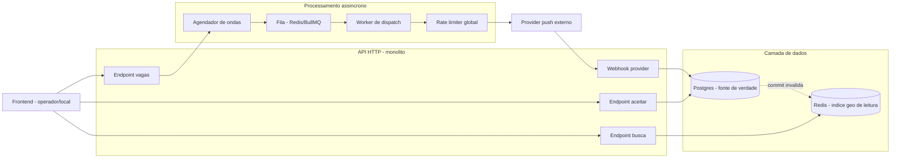

# Spec — Dispatch em Ondas para Vagas Urgentes (FieldPro)

Documento no formato **Spec-Driven Development**: três camadas — **Requirements** (o quê, em
linguagem verificável), **Design** (como, arquitetura e decisões técnicas) e **Tasks** (plano de
implementação rastreável a cada requisito). O objetivo é que qualquer requisito seja testável
diretamente a partir do texto, e que cada tarefa de implementação aponte de volta para o requisito
que ela satisfaz — nada é implementado sem rastreabilidade.

Critérios de aceite usam notação **EARS** (Easy Approach to Requirements Syntax):
`WHEN <evento> THE SYSTEM SHALL <comportamento>`, `IF <condição> THEN THE SYSTEM SHALL <comportamento>`,
`WHILE <estado> THE SYSTEM SHALL <comportamento>`.

---

## 1. Requirements

### Requirement 1 — Dispatch progressivo por ondas

**User Story:** Como local que publicou uma vaga urgente, quero que o sistema avise operadores em
grupos progressivos de prioridade, para que a vaga preencha rápido sem gerar excesso de
notificação para quem não tem prioridade.

**Acceptance Criteria:**
1. WHEN uma vaga é publicada com menos de 24h de antecedência (calculada no timezone da vaga)
   THE SYSTEM SHALL classificá-la como urgente e iniciar o fluxo de dispatch em ondas.
2. WHEN o dispatch de uma vaga urgente inicia THE SYSTEM SHALL agendar a Onda 1 contendo apenas
   operadores favoritados pelo local daquela vaga.
3. IF a Onda 1 dispara e a vaga permanece com status `aberta` após o intervalo definido
   THEN THE SYSTEM SHALL agendar a Onda 2 contendo operadores que trabalharam naquele local nos
   últimos 12 meses.
4. IF a Onda 2 dispara e a vaga permanece `aberta` após o intervalo definido
   THEN THE SYSTEM SHALL agendar a Onda 3 contendo todos os operadores elegíveis (especialidade
   compatível) dentro do raio configurado da vaga.
5. WHEN uma onda é agendada THE SYSTEM SHALL calcular o intervalo até o disparo como
   `max(intervalo_minimo, tempo_restante_ate_inicio / ondas_restantes)`.
6. IF o tempo restante até o início da vaga não comporta as 3 ondas com o intervalo mínimo
   THEN THE SYSTEM SHALL colapsar ondas restantes em um único disparo.
7. WHEN qualquer onda dispara THE SYSTEM SHALL registrar, por operador notificado, uma entrada em
   `notificacoes` com o número da onda correspondente.

### Requirement 2 — Confirmação exclusiva da vaga

**User Story:** Como plataforma, quero garantir que apenas um operador confirme uma vaga mesmo sob
concorrência real, para que nunca haja dois operadores confirmados no mesmo trabalho.

**Acceptance Criteria:**
1. WHEN um operador chama `POST /vagas/{id}/aceitar` E a vaga está com status `aberta`
   THE SYSTEM SHALL alterar o status para `confirmada`, associar o `operador_id` e retornar `200`.
2. IF a vaga já não está `aberta` no momento da tentativa
   THEN THE SYSTEM SHALL retornar `409 Conflict` sem alterar nenhum dado.
3. WHILE múltiplas requisições de aceitação chegam simultaneamente para a mesma vaga
   THE SYSTEM SHALL garantir, via operação atômica no banco (UPDATE condicional), que exatamente
   uma requisição receba `200` e todas as demais recebam `409`.
4. WHEN uma vaga é confirmada THE SYSTEM SHALL cancelar/ignorar qualquer onda futura ainda
   agendada para aquela vaga.
5. A garantia do critério 3 SHALL ser validada por teste automatizado que gera concorrência real
   (mínimo 100 requisições HTTP simultâneas), não concorrência simulada por mock.

### Requirement 3 — Anti-spam de notificações

**User Story:** Como operador, quero não ser inundado de notificações, para que eu continue
prestando atenção nas vagas relevantes.

**Acceptance Criteria:**
1. WHEN o sistema monta a lista de destinatários de qualquer onda THE SYSTEM SHALL excluir
   operadores que já receberam 3 ou mais notificações de vaga no dia corrente (contagem global,
   não apenas deste fluxo).
2. A exclusão do critério 1 SHALL ocorrer antes do envio, não como tratamento de falha posterior.
3. WHEN um operador atinge o limite diário THE SYSTEM SHALL simplesmente omiti-lo das ondas
   seguintes, sem enfileirar para o dia seguinte.

### Requirement 4 — Busca "vagas perto de mim"

**User Story:** Como operador, quero ver vagas próximas com filtros relevantes e sem risco de
tentar aceitar algo que já foi preenchido, para não perder tempo com vagas indisponíveis.

**Acceptance Criteria:**
1. WHEN um operador consulta `GET /vagas/perto-de-mim` com parâmetros de raio, data, especialidade
   e faixa de valor THE SYSTEM SHALL retornar apenas vagas com status `aberta` que atendem a todos
   os filtros.
2. THE SYSTEM SHALL responder a esse endpoint com p99 < 200ms sustentando 500 req/s.
3. WHEN uma vaga muda de status (confirmada, cancelada ou expirada) THE SYSTEM SHALL removê-la do
   índice de busca no mesmo commit da transação que altera o status no banco de dados primário.
4. IF um operador tenta aceitar uma vaga que aparecia como disponível na busca mas já foi
   confirmada por outro operador THEN THE SYSTEM SHALL retornar `409` (ver Requirement 2), e a
   interface SHALL remover o item da lista sem exigir refresh manual da página.

### Requirement 5 — Edição e cancelamento durante o dispatch

**User Story:** Como local, quero poder editar ou cancelar uma vaga a qualquer momento, mesmo com
o dispatch em andamento, sem que isso quebre a consistência do processo.

**Acceptance Criteria:**
1. WHEN um local edita uma vaga (endereço, valor, horário ou duração) THE SYSTEM SHALL incrementar
   o campo `versao` da vaga.
2. WHEN uma onda estava agendada com uma `versao_vaga_no_agendamento` anterior à versão atual da
   vaga no momento do disparo THEN THE SYSTEM SHALL abortar essa onda sem enviar notificações.
3. WHEN um local cancela uma vaga THE SYSTEM SHALL alterar seu status para `cancelada` e todas as
   ondas futuras agendadas SHALL ser abortadas na próxima verificação (Requirement 5.2).
4. Ondas já disparadas antes da edição NÃO SHALL ser reenviadas automaticamente com os dados
   atualizados; a interface do local SHALL exibir aviso informando isso no momento da edição.

### Requirement 6 — Integração com provider externo de push

**User Story:** Como plataforma, quero enviar notificações através do provider externo respeitando
seus limites, para não sofrer throttling nem perder rastreabilidade de entrega.

**Acceptance Criteria:**
1. THE SYSTEM SHALL manter um limitador de taxa global de no máximo 600 requisições por segundo ao
   provider, compartilhado entre todos os dispatches em andamento simultaneamente.
2. IF o provider responde `429` ou `5xx` THEN THE SYSTEM SHALL tentar novamente com backoff
   exponencial e jitter, até um teto configurável de tentativas.
3. IF o teto de tentativas é atingido THEN THE SYSTEM SHALL marcar a notificação como `falhou` e
   prosseguir sem bloquear o restante da onda.
4. WHEN o provider chama o webhook de callback informando entrega ou falha de uma notificação
   THE SYSTEM SHALL atualizar o status correspondente em `notificacoes` usando `provider_message_id`
   como chave de idempotência.
5. IF o mesmo evento de callback é recebido mais de uma vez THEN THE SYSTEM SHALL processá-lo sem
   efeito duplicado (idempotência).

### Requirement 7 — Interface simples ponta a ponta

**User Story:** Como operador ou local, quero uma interface mínima para visualizar/publicar vagas e
aceitar oportunidades, para validar o fluxo completo sem depender apenas da API.

**Acceptance Criteria:**
1. WHEN um operador acessa a tela de busca THE SYSTEM SHALL exibir a lista de vagas com os filtros
   do Requirement 4.1 e permitir aceitar uma vaga diretamente do card.
2. WHEN um local acessa a tela de publicação THE SYSTEM SHALL permitir criar, editar e cancelar uma
   vaga através de formulário.
3. IF uma tentativa de aceitação retorna `409` THEN a interface SHALL exibir mensagem clara de que
   a vaga já foi preenchida.

---

## 2. Design

### 2.1 Visão de componentes

### 2.2 Modelo de dados

Ver seção 6 do PRD (`PRD-FieldPro-Dispatch-Ondas.md`) para o DDL completo de `vagas`,
`dispatch_ondas`, `notificacoes`, `operador_favoritos` e `operador_historico_local`. Este spec não
duplica o schema; referencia-o como fonte única.

### 2.3 Decisões de design chave

| Decisão | Alternativa considerada | Por que esta foi escolhida |
|---|---|---|
| UPDATE condicional atômico para aceitação (Req. 2) | `SELECT ... FOR UPDATE` + UPDATE em transação | Uma única operação, sem round-trip extra, sem necessidade de transação explícita; o MVCC do Postgres já serializa. |
| Auto-checagem de versão no disparo da onda (Req. 5) | Varrer a fila e remover jobs ativamente ao cancelar/editar | Evita race entre "cancelar" e "remover da fila"; mais simples e sem estado adicional de sincronização. |
| Redis como índice de leitura, Postgres como fonte de verdade (Req. 4) | Servir busca direto do Postgres com índice geoespacial nativo (PostGIS) | Mais rápido de entregar dado o SLA de p99<200ms; PostGIS fica como possível evolução futura (fora de escopo, ver PRD §3). |
| Rate limiter global (não por-vaga) (Req. 6) | Rate limiter por dispatch individual | O limite de 600rps é do provider como um todo; limitar por vaga isoladamente não impede estouro agregado no pico de segunda-feira. |
| Idempotência via chave única (`provider_message_id`) | Deduplicação por janela de tempo | Determinística e auditável; não depende de heurística de tempo. |

### 2.4 Tratamento de erros

- Falha ao montar destinatários de uma onda (ex.: erro de query): onda marcada como `abortada`,
  log de erro, próxima onda segue seu próprio agendamento normalmente (não trava o dispatch).
- Falha do provider além do teto de retries (Req. 6.3): notificação individual marcada como
  `falhou`; não impede o restante da onda nem o avanço para a próxima onda.
- Falha ao invalidar o índice Redis após commit no Postgres (Req. 4.3): tratado como erro crítico
  monitorado — Postgres permanece fonte de verdade, então o pior caso é uma vaga aparecer na busca
  por uma janela curta até correção, mas o `POST /aceitar` sempre corrige com `409` (garantia do
  Req. 2 nunca depende do Redis estar correto).

### 2.5 Estratégia de testes

| Requisito | Tipo de teste | O que valida |
|---|---|---|
| Req. 1 | Unitário + integração | Cálculo de intervalo, colapso de ondas, transição entre ondas |
| Req. 2 | Integração com concorrência real | 100 requisições paralelas → exatamente 1 sucesso (não mock) |
| Req. 3 | Unitário | Query de contagem exclui corretamente operadores no limite |
| Req. 4 | Carga (load test) | p99 < 200ms @ 500rps; staleness Postgres↔Redis |
| Req. 5 | Integração | Edição/cancelamento invalida onda agendada corretamente |
| Req. 6 | Integração com mock do provider | Retry, backoff, idempotência do webhook |
| Req. 7 | E2E manual / smoke test | Fluxo completo publicar → notificar → aceitar na UI |

---

## 3. Tasks

Cada tarefa referencia o(s) requisito(s) que implementa entre colchetes. Ordem sugerida de
execução (respeitando dependências).

- [ ] 1. Modelagem e migrations do banco (`vagas`, `dispatch_ondas`, `notificacoes`,
      `operador_favoritos`, `operador_historico_local`) — _[Req. 1, 2, 3, 5, 6]_
- [ ] 2. Endpoint `POST /vagas/{id}/aceitar` com UPDATE condicional atômico — _[Req. 2.1, 2.2]_
- [ ] 3. Teste de concorrência real (100 requisições paralelas) para o endpoint de aceitação — _[Req. 2.3, 2.5]_
- [ ] 4. Cálculo de "urgente" respeitando timezone da vaga — _[Req. 1.1]_
- [ ] 5. Agendador de ondas: cálculo de intervalo e colapso de ondas — _[Req. 1.5, 1.6]_
- [ ] 6. Queries de destinatários por onda (favoritos, histórico, raio) — _[Req. 1.2, 1.3, 1.4]_
- [ ] 7. Filtro de anti-spam aplicado na montagem de cada onda — _[Req. 3.1, 3.2, 3.3]_
- [ ] 8. Interrupção de ondas futuras ao confirmar a vaga — _[Req. 1.7, 2.4]_
- [ ] 9. Versionamento de vaga e revalidação no disparo da onda — _[Req. 5.1, 5.2]_
- [ ] 10. Cancelamento de vaga e abort de ondas pendentes — _[Req. 5.3]_
- [ ] 11. Cliente HTTP para o provider de push + rate limiter global — _[Req. 6.1]_
- [ ] 12. Retry com backoff exponencial para 429/5xx — _[Req. 6.2, 6.3]_
- [ ] 13. Endpoint de webhook + idempotência por `provider_message_id` — _[Req. 6.4, 6.5]_
- [ ] 14. Índice geoespacial no Redis + invalidação no commit — _[Req. 4.3]_
- [ ] 15. Endpoint `GET /vagas/perto-de-mim` com filtros — _[Req. 4.1]_
- [ ] 16. Teste de carga do endpoint de busca (p99<200ms @ 500rps) — _[Req. 4.2]_
- [ ] 17. Frontend: tela de busca com filtros e botão aceitar — _[Req. 7.1, 4.4]_
- [ ] 18. Frontend: tela de publicação/edição/cancelamento de vaga — _[Req. 7.2, 5.4]_
- [ ] 19. Frontend: tratamento de `409` sem refresh manual — _[Req. 7.3]_
- [ ] 20. Observabilidade: logs estruturados e métricas (409, staleness, taxa de erro do provider)
      — _[transversal, suporta validação de Req. 2, 4, 6]_

---

## 4. Rastreabilidade (resumo)

Todo requisito acima tem pelo menos uma task associada e pelo menos um tipo de teste definido em
§2.5. Nenhuma task deveria ser considerada "concluída" sem que o critério de aceite EARS
correspondente esteja verificável — seja por teste automatizado (preferencial) ou por verificação
manual documentada, no caso do Req. 7 (E2E).
